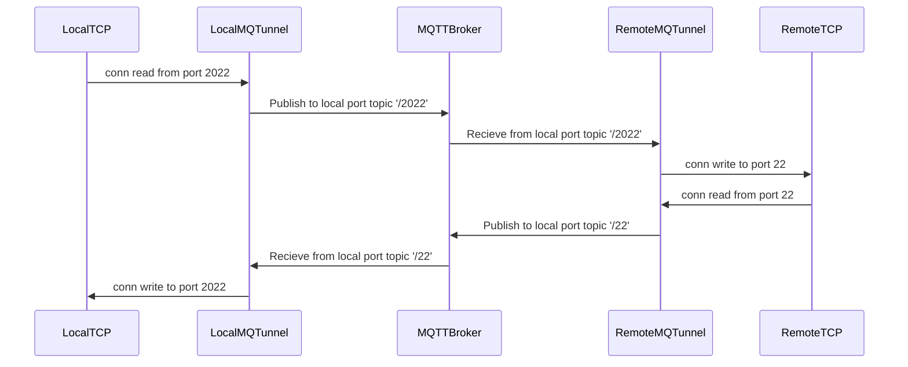

# MQTTunnelNet: Tunnel TCP via MQTT broker

This library is a wrapper around libmqttunnel (https://github.com/Staatsgeheim/libmqttunnel)


# How to use

Remote and local instances use the same Config file.

Create and start a server (remote)
```
    var server = MQTTunnel.CreateServer("config.json");
    server.StartAsync();
```

Create and connect a tunnel (local)
```
    var tunnel = MQTTunnel.CreateTunnel("config.json", 9000, 8000)
    tunnel.StartAsync();
```

Create and connect multiple tunnels (local)
```
    var tunnel1 = MQTTunnel.CreateTunnel("config.json", 9000, 8000)
    tunnel1.StartAsync();
    var tunnel2 = MQTTunnel.CreateTunnel("config.json", 9001, 8001)
    tunnel2.StartAsync();
```

# Config file 

You can use client certs as well as username/password or both in the Config file.

```
{
    "host": "mqttbroker.example",
    "port": 8883,
    "username", "",
    "password", "",
    "caCert": "root-CA.crt",
    "clientCert": "certificate.pem.crt",
    "privateKey": "private.pem.key",
    "control": "device/1/control"
}
```

Other options

- `clientId`: MQTT ClientID. If empty, random string is generated

Info

- `control`: Sets the MQTT topic that is used for this instance

# Architecture

Example: Local port = 2022, Remote port = 22,



## More internal architecture


# License

- MIT
