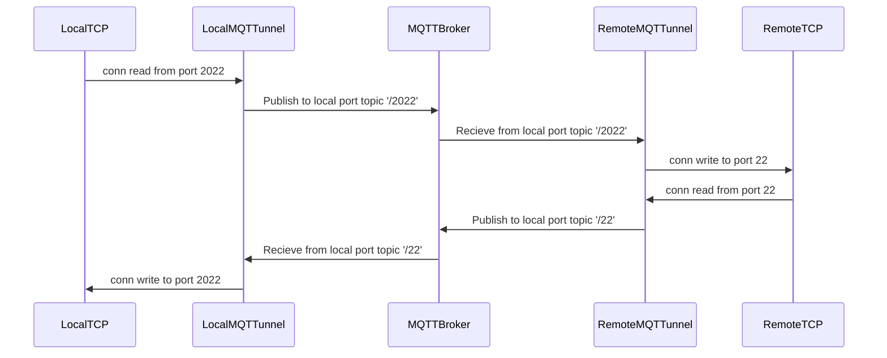
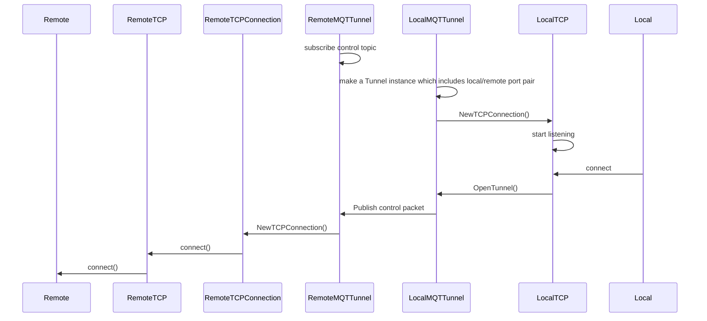

# MQTTunnelNet: Tunnel TCP via MQTT broker
[](https://www.nuget.org/packages/MQTTunnelNet/)

This library is a wrapper around libmqttunnel (https://github.com/Staatsgeheim/libmqttunnel)

# Changelog

## v1.0.3
* Changed the native library loading mechanism for cross platform compatibility 
* Added MacOS x64 support
* Added MacOS ARM64 support
* Added Linux x64 support
* Added .NET 9 support


#### The library now supports:
##### Platforms:
* Windows x86
* Windows x64
* MacOS x64*
* MacOS ARM64*
* Linux x64

###### MacOS Notes*
Run
```xattr -r -d com.apple.quarantine libmqttunnel_x64.dylib```
or
```xattr -r -d com.apple.quarantine libmqttunnel_arm64.dylib```
to enable the libary to load unsigned

##### Runtimes:
* net45
* net451
* net452
* net46
* net461
* net462
* net463
* net47
* net471
* net472
* net48
* net481
* net5.0
* net6.0
* net7.0
* net8.0
* net9.0
* netstandard2.0
* netstandard2.1
* netcoreapp3.0
* netcoreapp3.1

## v1.0.2

* Added 32 bits support
* Added support to load configs from memory instead of disk
* Added MQTTunnelLogLevel to give more control over the log level
```
enum MQTTunnelLogLevel : int
{
    None = -1,
    DebugLevel = 0,
    InfoLevel = 1,
    WarnLevel = 2,
    ErrorLevel = 3,
    PanicLevel = 4,
    FatalLevel = 5
}
```
* Added support for more .NET versions 
```
net45
net451
net452
net46
net461
net462
net463
net47
net471
net472
net48
net481
net5.0
net6.0
net7.0
net8.0
net9.0
netstandard2.0
netstandard2.1
netcoreapp3.0
netcoreapp3.1
```
# How to use

Remote and local instances use the same Config file.

Create and start a server (remote)
```
    var server = MQTTunnel.CreateServer("config.json");
    server.StartAsync();
```

Create and connect a tunnel (local)
```
    var tunnel = MQTTunnel.CreateTunnel("config.json", 9000, 8000)
    tunnel.StartAsync();
```

Create and connect multiple tunnels (local)
```
    var tunnel1 = MQTTunnel.CreateTunnel("config.json", 9000, 8000)
    tunnel1.StartAsync();
    var tunnel2 = MQTTunnel.CreateTunnel("config.json", 9001, 8001)
    tunnel2.StartAsync();
```

Using a config in memory

```
    var configJsonData = @"
    {
        "host": "mqttbroker.example",
        "port": 8883,
        "username", "",
        "password", "",
        "caCert": "root-CA.crt",
        "clientCert": "certificate.pem.crt",
        "privateKey": "private.pem.key",
        "control": "device/1/control"
    }";
```

Create and start a server using a config in memory (remote)
```
    var server = MQTTunnel.CreateServerMem(configJsonData);
    server.StartAsync();
```

Create and connect a tunnel using a config in memory  (local)
```
    var tunnel = MQTTunnel.CreateTunnelMem(configJsonData, 9000, 8000)
    tunnel.StartAsync();
```

Create and connect multiple tunnels using a config in memory (local)
```
    var tunnel1 = MQTTunnel.CreateTunnelMem(configJsonData, 9000, 8000)
    tunnel1.StartAsync();
    var tunnel2 = MQTTunnel.CreateTunnelMem(configJsonData, 9001, 8001)
    tunnel2.StartAsync();
```

# Config file 

You can use client certs as well as username/password or both in the Config file.

```
{
    "host": "mqttbroker.example",
    "port": 8883,
    "username", "",
    "password", "",
    "caCert": "root-CA.crt",
    "clientCert": "certificate.pem.crt",
    "privateKey": "private.pem.key",
    "control": "device/1/control"
}
```

Other options

- `clientId`: MQTT ClientID. If empty, random string is generated

Info

- `control`: Sets the MQTT topic that is used for this instance

# Architecture

Example: Local port = 2022, Remote port = 22,



## More internal architecture




# License

- MIT
